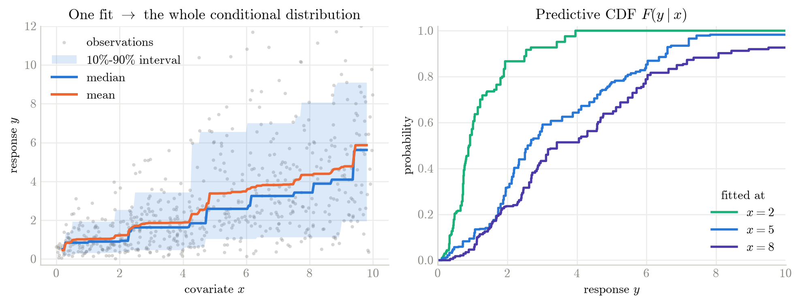
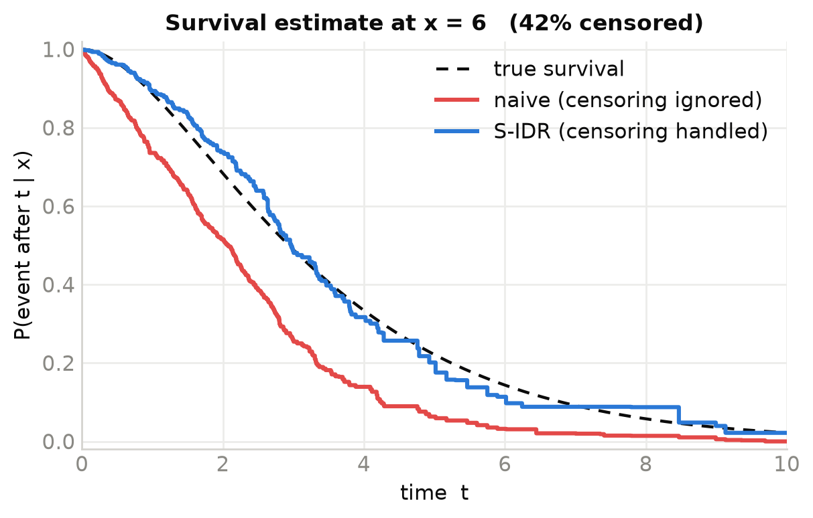
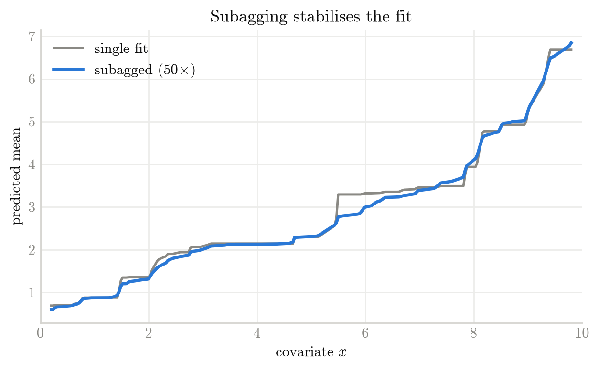

# isodistrreg: Isotonic Distributional Regression

<p align="center"><strong><a href="bindings/python/README.md">Python</a> (<a href="https://pypi.org/project/isodistrreg/">PyPI</a>) · <a href="bindings/R/README.md">R</a> (<a href="https://cran.r-project.org/package=isodistrreg">CRAN</a>) · <a href="isodistrreg/README.md">Rust</a> (<a href="https://crates.io/crates/isodistrreg">crates.io</a>)</strong></p>

Implementations of **Isotonic Distributional Regression (IDR)** and its
**Survival-IDR (S-IDR)** extension for right-censored data.

Most regression methods answer *“what is the expected value of `y` given `x`?”*.
(S-)IDR answers the more useful question *“what is the **whole distribution**
of `y` given `x`?”* — it returns a full conditional CDF, from which means, 
quantiles, prediction intervals, exceedance probabilities and proper scores all
follow. These conditional distributions are stochastically monotone, meaning
that each quantile is nondecreasing / nonincreasing, which is useful when
estimating effects that only move in one direction (effect of the dose size on 
the response, early discovery of cancer improves survival, recalibrating models,
...). And it does so:

- **without tuning parameters** — the nonparametric fit gets more complex as
  more data is available;
- **monotonically** - the fitted estimator is guaranteed to respect the 
  isotonicity assumption;
- **calibrated and sharp** — the fit is in-sample threshold calibrated and
  simultaneously optimal for a large class of proper scoring rules (CRPS, Brier
  score, quantile loss, …).

**Available in [Python](bindings/python/README.md), [R](bindings/R/README.md),
and [Rust](isodistrreg/README.md)** — one Rust core, the same operations in each;
installation and full worked examples live in each linked README. The snippets
below use Python.

## A distribution, not a point

Give IDR a covariate `x` and a response `y` and it estimates the entire
conditional distribution `F(y | x)` in one fit — no bins, no bandwidths, no
assumed distributional family.

```python
import numpy as np
from isodistrreg import IDR

# 600 observations; both the mean and the spread of y grow with x
rng = np.random.default_rng(20)
x = rng.uniform(0, 10, size=600)
y = rng.gamma(shape=2.0, scale=(x + 1) / 4)

fit = IDR(y, x)                                  # no tuning parameters

fit.quantile(np.array([[2.0], [5.0], [8.0]]),    # 10/50/90% quantiles ...
             np.array([[0.1, 0.5, 0.9]]))        # ... at x = 2, 5, 8
fit.predict(np.array([2.0, 5.0, 8.0]))           # conditional mean at each x
fit.cdf(np.array([2.0, 5.0, 8.0]))               # the full predictive CDF at each x
```

<p align="center"></p>

<p align="center"><sub>The mean and median (left) trace the centre of the
response while the shaded 10 %–90 % band widens exactly where the data become
more dispersed, so the <em>spread</em> is captured, not just the location. The
entire distribution shifts and stretches as <code>x</code> grows (right).</sub></p>

## Right-censored outcomes (S-IDR)

In time-to-event problems the outcome is often only observed up to a censoring
time: all we know is that the event had not happened yet. **S-IDR** takes a
censoring indicator alongside each observation and estimates the conditional
distribution of the *true* event time. Ignoring censoring — treating each
censored time as if the event happened right then — biases the estimate, which 
S-IDR corrects.

```python
# y = true event time, c = censoring time; we observe only whichever comes first
t = np.minimum(y, c)                             # observed time (event or censoring)
d = y <= c                                       # True if the event was seen (else censored)
fit = IDR(t, x, d)                               # or IDR(y, x) with y a structured array of (time, event)
survival = 1 - fit.cdf(6.0)                       # P(event after t | x = 6)
```

<p align="center"></p>

<p align="center"><sub>Treating censored observations as events causes bias and
the naive survival curve drops too fast. Because the tail beyond the last
observed event is unknown, the S-IDR survival curve may not reach 0.0 (i.e.,
the cdf may not reach 1.0).</sub></p>

## Subagging

**Subagging** fits IDR on many random subsamples and averages the resulting 
distributions. Each fit sees only a fraction of the data, so it is far cheaper,
and the fits are independent, so they run in parallel across cores via `n_jobs`.
On large datasets a single fit can be more costly than many small fits,
especially if censoring is present. The averaged estimate is also smoother and
more stable than a single fit.

```python
# Smooth truth: y is gamma with mean and spread rising smoothly with x
y = rng.gamma(shape=2.0, scale=(x + 1) / 4)

# Average 50 fits, each on a random half of the data, across 4 cores
fit = IDR(y, x, subsamples=50, subsample_size=0.5, n_jobs=4, seed=1)
```

<p align="center"></p>

<p align="center"><sub>The single fit's abrupt jumps are averaged into a smoother, more stable estimate that tracks the true 80th percentile (dashed).</sub></p>

## Multivariate covariates & partial orders

Every example above used a single numeric covariate with its natural ordering.
IDR also handles **multivariate covariates**, where you specify a *partial order*
on the covariate space — component-wise ordering, the increasing convex order
(useful for comparing forecast ensembles), or groups of these. This is how IDR
post-processes an entire weather-forecast ensemble at once; the
[R package README](bindings/R/README.md) walks through a full precipitation
example. Partial-order support lives behind an optional feature in the Rust crate.

## References

Henzi, A., Ziegel, J. and Gneiting, T. (2021). Isotonic distributional
regression. *J R Stat Soc Series B*, 83: 963–993.
<https://doi.org/10.1111/rssb.12450>

Henzi, A., Moesching, A. and Duembgen, L. (2022). Accelerating the
Pool-Adjacent-Violators Algorithm for Isotonic Distributional Regression.
*Methodol Comput Appl Probab*.
<https://doi.org/10.1007/s11009-022-09937-2>

Bladt, M., Henzi, A., van den Heuvel, B. and Ziegel, J. (2026). Survival
Isotonic Distributional Regression. *arXiv preprint* arXiv:2608.02914.
<https://arxiv.org/abs/2608.02914>

<sub>Figures reproduced by [`doc/make_figures.py`](doc/make_figures.py) — needs the Python bindings plus `numpy`, `scipy` and `matplotlib`.</sub>
